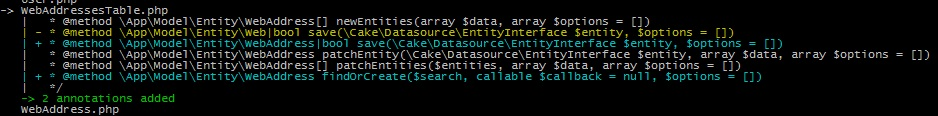

#  CakePHP IdeHelper Plugin

[](https://travis-ci.org/dereuromark/cakephp-ide-helper)
[](https://codecov.io/github/dereuromark/cakephp-ide-helper?branch=master)
[](https://packagist.org/packages/dereuromark/cakephp-ide-helper)
[](https://php.net/)
[](https://packagist.org/packages/dereuromark/cakephp-ide-helper)
[](https://packagist.org/packages/dereuromark/cakephp-ide-helper)

IdeHelper plugin for CakePHP applications.

> Boost your productivity. Avoid mistakes.

**This branch is for CakePHP 3.4+**

## Features

The main idea is to improve IDE compatibility and use annotations to make the IDE understand the
"magic" of CakePHP, so you can click through the classes and object chains as well as see obvious issues and mistakes.
The IDE will usually mark problematic code yellow (missing, wrong method etc).

- Add annotations to existing code (e.g. when upgrading an application) just like baking would to new code.
- Can run multiple times without adding the annotations again.
- It can also replace outdated annotations.
- Works with your application as well as any loaded plugin.
- CI check support, hook it up just like the coding standards check.

Supported annotations by this plugin:
- Models (Tables and Entities)
- Controllers (including prefixes like `Admin`)
- View (AppView)
- Templates (`.ctp` files including elements)
- Shells (and Tasks)
- Components
- Helpers



### IDE support
This plugin is **supposed to work with ANY IDE that supports annotations**.
IDEs tested so far for 100% compatibility:
- PHPStorm
- IntelliJ
- ... [Report or PR your IDE of choice here to confirm its full compatibility]

See [Wiki](https://github.com/dereuromark/cakephp-ide-helper/wiki) for details and tips/settings.

## Install
Install it as `require-dev` dependency:
```
composer require --dev dereuromark/cakephp-ide-helper
```

## Setup
Enable the plugin in your `config/bootstrap_cli.php` or call
```
bin/cake plugin load IdeHelper --cli
```

Note: As require-dev dependency this should only be loaded for local development (include a check or try/catch).

## Using the annotation shell
Running it on your app:
```
bin/cake annotations [type]
```
By default it will print out a diff of the changes incl the amount of modified lines if applicable.

Running it on a loaded plugin:
```
bin/cake annotations [type] -p FooBar
```

Use `-v` for verbose and detailed output:
```
bin/cake annotations [type] -v
```

You can add `-d` (`--dry-run`) to simulate the output without actually modifying the files.

See the **[Docs](https://github.com/dereuromark/cakephp-ide-helper/tree/master/docs)** for details.
