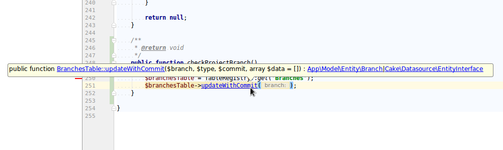
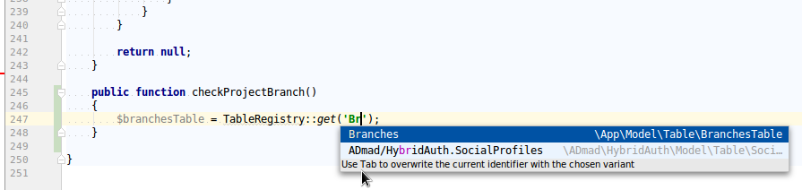
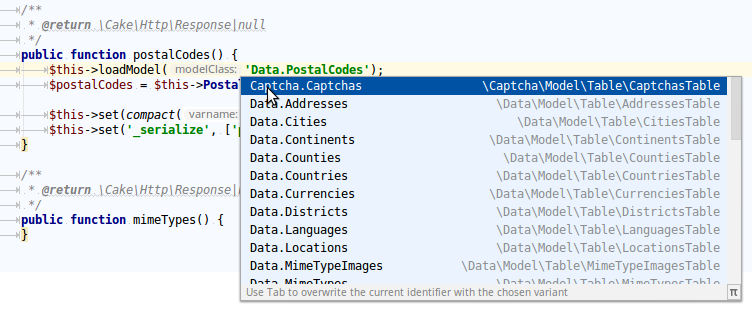
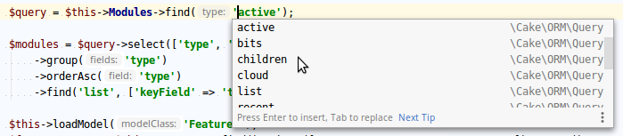

#  Meta File Generator





PhpStorm TOC
- [Available tasks](#available-tasks)
  * [Plugins](#plugins)
  * [Models](#models)
  * [Entities](#entities)
  * [TableAssociations](#tableassociations)
  * [TableFinders](#tablefinders)
  * [Behaviors](#behaviors)
  * [Components](#components)
  * [Helpers](#helpers)
  * [Mailers](#mailers)
  * [Types](#types)
  * [Elements](#elements)
  * [Layouts](#layouts)
  * [Cache](#cache)
  * [FormHelper](#formhelper)
  * [Validation](#validation)
    + [Validator::requirePresence()](#validator--requirepresence--)
  * [Request params](#request-params)
  * [Configure keys](#configure-keys)
  * [ENV keys](#env-keys)
  * [Translation keys](#translation-keys)
  * [ConnectionManager](#connectionmanager)
  * [Fixtures](#fixtures)
  * [Migrations plugin database tables](#migrations-plugin-database-tables)
- [Adding your own tasks](#adding-your-own-tasks)
  * [Replacing native tasks](#replacing-native-tasks)
  * [Available directives](#available-directives)
    + [Override](#override)
    + [ExpectedArguments](#expectedarguments)
    + [ExpectedReturnValues](#expectedreturnvalues)
    + [RegisterArgumentsSet](#registerargumentsset)
    + [ExitPoint](#exitpoint)
  * [Example](#example)
- [Include/Exclude Plugins](#include-exclude-plugins)
- [CI or pre-commit check](#ci-or-pre-commit-check)

## PhpStorm
This command will generate your `.ide-helper.meta.php` in your app's `ROOT/.phpstorm.meta.php/` directory:
```
bin/cake phpstorm generate
```

Make sure it is indexed (maybe a restart of PhpStorm could be required).

Note: We are using a directory here to allow custom and manually created meta files along with this generated file.
Any file inside this directory will be parsed and used. Prefixing with a `.` dot is recommended for PHPCS to skip this file automatically.

### Available tasks

#### Plugins
In your `Application.php` you can, after composer requiring (and refreshing meta file), auto-complete the available plugins for your `addPlugin()` calls:
```php
    public function bootstrap() {
        ...
        $this->addPlugin('TypeHere');
    }
```
This is especially useful for more complex and possibly vendor-prefix names (e.g. `'Cake/TwigView'`, note the forward slash).

#### Models
```php
/** @var \App\Model\Table\UsersTable $users */
$users = TableRegistry::get('Users');
$users->doSomething();
```
So far `$users` required the annotation above to be typehinted and clickable.
With the generated meta file this becomes not necessary anymore.
It will automatically detect this static factory call in the map and hint `$users` as `\App\Model\Table\UsersTable`, making
`doSomething()` available in the IDE for method argument checking and following.

This task also annotates the dynamic model factory calls (e.g. `$this->getTableLocator()->get('Users')`) or `loadModel()` usage.



If you prefer FQCN as argument, you will still get the benefit here for the return type:
```php
use App\Model\Table\UsersTable;

$users = TableRegistry::get(UsersTable::class);
$users->doSomething();
```
It now knows the concrete object of `$users` and can autocomplete the method call right away.

You will not be able to quickly select from a list of input options, however.

#### Entities
The following is now auto-completed, for example:
```php
$user->setDirty('field_name');
$user->setError('field_name');
$user->getOriginal('field_name');
...
```

#### TableAssociations
The following is now auto-completed, for example:
```php
$this->belongsTo('Authors');
$this->hasOne('Book');
$this->hasMany('Articles');
$this->belongsToMany('Tags.Tags');
```

#### TableFinders
The `'threaded'` string is now auto-completed, for example:
```php
$this->Posts->find('threaded');
```

Note: Using Configure key `'IdeHelper.preemptive'` set to `true` you can be a bit more verbose and include all possible custom finders, including those from behaviors.



#### Behaviors
The following is now auto-completed, for example:
```php
$this->addBehavior('Tools.Slugged');
$this->removeBehavior('Slugged'); // Note the alias without plugin prefix
```

#### Components
The following is now auto-completed, for example:
```php
$this->loadComponent('My.Useful');
$this->components()->unload('Useful'); // Note the alias without plugin prefix
```

#### Helpers
The following is now auto-completed, for example:
```php
$this->loadHelper('Tools.Tree');
```
And so is the ``addHelper()`` (added in CakePHP 4.1) on the `ViewBuilder`:
```php
$this->viewBuilder()
    ->addHelper('TinyAuth.AuthUser')
    ->addHelper('Tools.Tree');
```

#### Mailers
The following is now auto-completed and returns the corresponding Mailer class:
```php
$userMailer = $this->getMailer('User');
```

#### Types
In your bootstrap (app, or plugin), you might add additional database Type classes, or you reconfigure existing ones:
```php
Type::build('date')->useLocaleParser()->setLocaleFormat('d.m.Y');;
Type::build('datetime')->useLocaleParser()->setLocaleFormat('d.m.Y H:i');
```
The IDE will now recognize the returned type of class and allow auto-complete here, too.

Same for `Type::map()` and type strings like `integer`, `string` etc:
```php
Type::map('decimal', ...);
```

#### Elements
Are you making heavy use of elements in templates?
Tired of typing the full template name in `$this->element('...')` calls?

With this generator PhpStorm can auto-complete this, including all elements for plugins.

#### Layouts
`$this->viewBuilder->setLayout(...)` is now auto-completed.

#### Cache
`Cache::write()`, `Cache::read()` and other methods are now auto-completed for the cache engine(s) available.

#### FormHelper
`$this->Form->control()` is now auto-completed for the model fields available.

#### Validation

##### Validator::requirePresence()


Now not just bool true/false, but also the possible "magic strings" are typehinted and usable as single click/enter.

#### Request params
`$this->request->getParam()` auto-completes for `prefix`, `controller` and other common keys.

#### Configure keys


`Configure::read()` as well as the other methods are auto-completed for currently existing keys.
Numeric keys are excluded as they are usually not part of an associative array config.

#### ENV keys
`env()` is auto-completed for most common and used keys.

#### Translation keys
Using `__()` and `__d()` can be auto-completed based on your project's `.po` files.

Note: PhpStorm is [not smart enough yet](https://youtrack.jetbrains.com/issue/WI-52508) to auto-adjust any (escaped or not) quotes in your strings.
So in those cases you must be using `'` as delimiters for your strings, if you want auto-complete:
```
<?php echo __('A "quoted" string'); ?>
<?php echo __('A \'literally quoted\' string'); ?>
<?php echo __('A variable \'\'{0}\'\' be replaced.', __('will')); ?>
```
Any further `'` inside will be escaped for you.

#### ConnectionManager
`ConnectionManager::get()` is auto-completed for the currently configured connection aliases.

#### Fixtures
`TestCase::addFixture()` is auto-completed for the currently available fixtures from app, core and plugins.

#### Migrations plugin database tables
When using the Migrations plugin, this task will come in handy to quickly autocomplete existing tables,
their column names and possible column types.

It by default excludes CakePHP internal tables and all `phinxlog` ones.
You can use a regex blacklist to further exclude certain tables:

```php
'IdeHelper' => [
    'skipDatabaseTables' => [
        '/customRegexPattern/',
        ...
    ],
],
```

### Adding your own tasks
Just create your own Task class:
```php
namespace App\Generator\Task;

use IdeHelper\Generator\Task\TaskInterface;

class MyTask implements TaskInterface {

    /**
     * @return \IdeHelper\Generator\Directive\BaseDirective[]
     */
    public function collect(): array {
        ...
    }

}
```

Then add it to the config:
```php
'IdeHelper' => [
    'generatorTasks' => [
        'MyTask' => \App\Generator\Task\MyTask::class,
    ],
],
```
The key `'MyTask'` can be any string but it must be unique across all existing tasks.

#### Replacing native tasks
Using associative arrays you can even exchange any native task with your own implementation:
```php
'IdeHelper' => [
    'generatorTasks' => [
        \IdeHelper\Generator\Task\ModelTask::class => \App\Generator\Task\MyEnhancedModelTask::class,
    ],
],
```
The native class name is the key then, your replacement the value.
Setting the value to `null` completely disables a native task.

#### Available directives

##### Override
By default, most directives used here are "override". Those are also the ones already supported the longest.
For specific string method argument it returns a specific object. That covers a lot of CakePHP's internal magic.
```php
$method = '\Namespace\PackageName\MyFactory::create(0)';
$map = [
    'alpha' => '\My\Cool\Alpha::class',
    'beta' => '\My\Cool\Beta::class',
];
$directive = new Override($method, $map);
```
You can also use the `ClassName` VO together with real `::class` usage and imports:
```php
use IdeHelper\ValueObject\ClassName;
use My\Cool\Alpha;
use My\Cool\Beta;

$map = [
    'alpha' => ClassName::create(Alpha::class),
    'beta' => ClassName::create(Beta::class),
];
```

##### ExpectedArguments
With this you can set default values to chose from for method arguments.
Specify the parameter count as 0-based value.
```php
$method = '\Namespace\PackageName\MyFactory::create()';
$position = 0;
$list = [
    '\'alpha\'',
    '\'beta\'',
];
$directive = new ExpectedArguments($method, $position, $list);
```
Note the escaped quotes around literal string values.
If you want to make it a bit cleaner, use the `StringName` VO, as it auto-quotes on output:
```php
use IdeHelper\ValueObject\StringName;

$list = [
    StringName::create('alpha'),
    StringName::create('beta'),
];
```

##### ExpectedReturnValues
You can also just expected return types for a method.
```php
$method = '\Namespace\PackageName\MyFactory::create()';
$list = [
    '\My\Cool\Alpha::class',
    '\My\Cool\Beta::class',
];
$directive = new ExpectedReturnValues($method, $list);
```

##### RegisterArgumentsSet
If you are reusing the same lists for both arguments and return values, you can also
make a set and reuse that in the above directives.
```php
$set = 'mySet';
$list = [
    '\My\Cool\Executer::SUCCESS',
    '\My\Cool\Executer::ERROR',
];
$directive = new RegisterArgumentsSet($set, $list);
```
Now you can use it as list value `argumentsSet('mySet')` inside the others.
For this just pass the `$directive` object itself to the list, which then contains only this one element.

Note that you can also the `LiteralName` VO for constants and whatever does
not need to be outputted as string:
```php
use IdeHelper\ValueObject\LiteralName;

$list = [
    LiteralName::create('\My\Cool\Executer::SUCCESS'),
    LiteralName::create('\My\Cool\Executer::ERROR'),
];
```

If you want to reuse existing argument sets from other tasks, you can use the `ArgumentsSet` value object referencing them:

```php
use IdeHelper\Generator\Directive\ExpectedArguments;
use IdeHelper\ValueObject\ArgumentsSet;

$method = '\\' . static::CLASS_FORMAT_HELPER . '::sidebarLink()';
$list = [
    ArgumentsSet::create(FormatIconFontAwesome5Task::SET_ICONS_FONTAWESOME),
];
$directive = new ExpectedArguments($method, 1, $list);
```
Just make sure those argument sets are actually available, as this is not checked for you.

##### ExitPoint
This new directive can help to let the IDE know what methods abort the current code flow.
It will show "Unreachable statement" warning and usually highlight the following code in yellow to inform you.
```php
$directive = new ExitPoint('\My\Class::method()');
```

#### Example
So let's imagine you have the following methods you want to annotate:
```php
$alpha = MyFactory::create('alpha'); // Returns \My\Cool\Alpha class
$beta = MyFactory::create('beta'); // Returns \My\Cool\Beta class
```
Then let's create an `Override`, to get the correct class instance returned:
```php
$method = '\Namespace\PackageName\MyFactory::create(0)';
$map = [
    'alpha' => '\My\Cool\Alpha::class',
    'beta' => '\My\Cool\Beta::class',
];
$override = new Override($method, $map);
```
Note that map keys are usually always strings and outputted auto-quoted by default.
So you can treat them always as simple/literal strings.

Now let's imagine you have multiple class methods that can return some constants.
Here we first create the reusable set:
```php
$list = [
    '\My\Cool\Executer::SUCCESS',
    '\My\Cool\Executer::ERROR',
];
$argumentsSet = new RegisterArgumentsSet('mySet', $list);
```
Now we can use it for all methods:
```php
$method = '\My\Cool\Executer::execute()';
$list = [
    $argumentsSet,
];
$expectedReturnValues = new ExpectedReturnValues($method, $list);
```
Then make sure your Task's `collect()` method returns all of them:
```php
return [
    $override->key() => $override,
    $argumentsSet->key() => $argumentsSet,
    $expectedReturnValues->key() => $expectedReturnValues,
    ...
];
```
As key for the directive values always use their `->key()` string.

For more examples and details see their [documentation](https://confluence.jetbrains.com/display/PhpStorm/PhpStorm+Advanced+Metadata).

#### Literal keys
If you really need literal string keys (no auto quoting), you can use the `KeyValue` VO:
```php
$key = ClassName::create(Bar::class);
$value = ClassName::create(Bar::class);
$keyValue = KeyValue::create($key, $value);

// Now use it as as any other value
$map = [
    'thisKeyIsOnlyForSortingNow' => $keyValue,
    ...
];
$directive = new Override('\\' . Table::class . '::returnMy(0)', $map);
```
It allows you to control the quoting of both key and value.
The map key here is only used for sorting then.

Note: This VO can only be used for the `Override` directive which actually makes use of associative keys.

### Include/Exclude Plugins
Many plugins don't need to be "loaded". Those usually would not be included in the generator tasks,though.
If you want to add some not loaded plugins into the list of plugins to process, use:
```php
'IdeHelper' => [
    'plugins' => [
        'MyNotLoadedPlugin',
        '-BlacklistedLoadedPlugin',
    ],
],
```
With the `-` prefix, you can even exclude loaded plugins from being processed.

### CI or pre-commit check
Using `-d` (dry run) option you will get an error code 2 if the file would need updating.
This way you can automate the check for CI tooling or commit hooks.

### Reusing sets
You can re-use sets that are present from any of the built-in or your custom tasks.

In verbose mode the console gives you the available sets for re-use:
```
bin/cake phpstorm generate -v
```

You can then just directly make use of them in any matching directive (for such lists):
- ExpectedArguments
- ExpectedReturnValues
