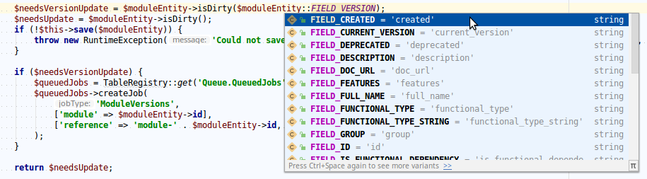

# PHP File Illuminator

The Illuminator can modify your PHP files based on Illuminator rulesets.
You can use the pre-set tasks, or create your own to enhance your PHP files and classes.

Note: Instead of meta modifications (doc blocks, annotations) like the Annotator, this Illuminator actually modifies existing code.
Make sure to backup/commit your changes before running it.

Each task has its own scope defined, based on path or filename.
If that doesnt match, it will be skipped.

### Available tasks

#### EntityField
Your entities expose their fields either via get()/set() or as class properties.
Especially when using them through methods, you will have no typehinting/autocomplete on those magic strings.
In these cases, having class constants is the solution.
This task will add those based on the defined property annotations in the doc block:
```php
/**
 * @property int $id
 * @property string $brand_name
 * @property \Cake\I18n\FrozenTime $created
 * @property \Cake\I18n\FrozenTime|null $retired
 * @property \App\Model\Entity\Wheel[] $wheels
 */
class Car extends Entity {

    public const FIELD_ID = 'id';
    public const FIELD_BRAND_NAME = 'brand_name';
    ...

}
```
This is especially useful then for e.g.
```php
// old
$carEntity->setDirty('wheels');

// new
$carEntity->setDirty($carEntity::FIELD_WHEELS);
```
or
```php
// old
$query->orderDesc('publish_date');

// new
$query->orderDesc(Post::FIELD_PUBLISH_DATE);
```

This allows for less typing as autocomplete finds it immediately - and for usage display (IDE => rightclick => get usage).
That also means refactoring on those is much easier this way (via IDE usually a clean one-modification-refactor across the whole project).

Note: For PHP 7.1+ it will also add the visibility flag `public` if you don't configure it otherwise.

This task will not clean out removed or renamed fields.
You should quickly check for usage of this constant if unused it can be safely removed.



### Adding your own tasks
Just create your own Task class:
```php
namespace App\Illuminator\Task;

use IdeHelper\Illuminator\Task\TaskInterface;

class MyTask implements TaskInterface {

    /**
     * @param string $path
     * @return bool
     */
    public function shouldRun($path) {
        ...
    }

    /**
     * @param string $content
     * @param string $path
     * @return string
     */
    public function run($content, $path) {
        ...
    }

}
```

Then add it to the config:
```php
'IdeHelper' => [
    'IlluminatorTasks' => [
        'MyTask' => \App\Illuminator\Task\MyTask::class,
    ],
],
```
The key `'MyTask'` can be any string but it must be unique across all existing tasks.

#### Replacing native tasks
Using associative arrays you can even exchange any native task with your own implementation:
```php
'IdeHelper' => [
    'IlluminatorTasks' => [
        \IdeHelper\Illuminator\Task\FooBarTask::class => \App\Illuminator\Task\MyEnhancedFooBarTask::class,
    ],
],
```
The native class name is the key then, your replacement the value.
Setting the value to `null` completely disables a native task.


### Configuration

You can specify specific settings via `app.php` config:
- `'IdeHelper.illuminatorIndentation'` as `'    '` to have spaces as indentation whitespace, defaults to `"\t"`.

### Important constraint
Some tasks may be based on the results of the Annotator. So make sure you run that first, e.g.

```
bin/cake annotate all && bin/cake illuminator illuminate <path>
```

### CI or pre-commit check
Using `-d` (dry run) option you will get an error code 2 if the file would need updating.
This way you can automate the check for CI tooling or commit hooks.
